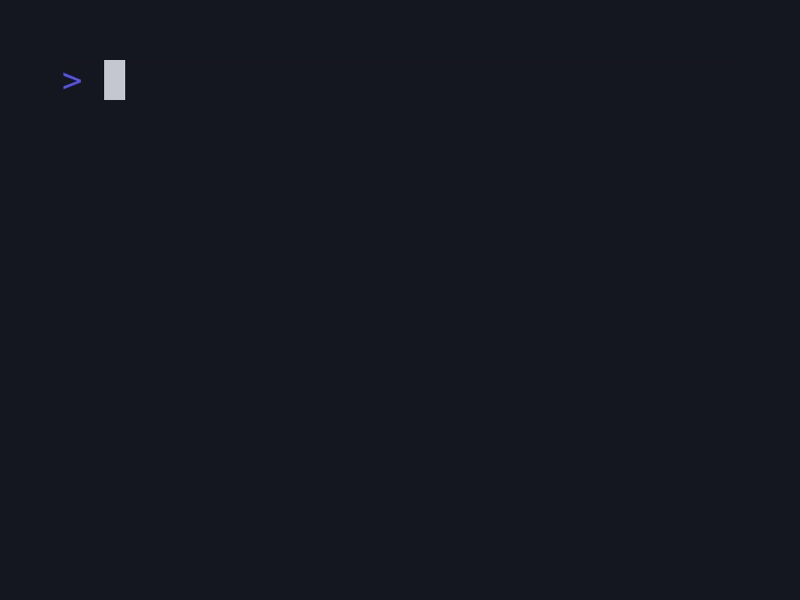

# term-clock

A digital clock that runs in your terminal, providing clock, alarm and timer.


## Features

- Clock Mode: Digital display of current time (24-hour format)
- Alarm Mode: Screen flashes at the specified time
- Timer Mode: Countdown timer (up to 99 minutes)
- Countdown Mode: Countdown from a specified duration to zero

## Installation

```bash
$ go install github.com/nsfisis/term-clock@latest
```

## Usage

### Clock Mode

Displays the current time in digital format.

```bash
$ term-clock clock
```

or

```bash
$ term-clock
```



### Alarm Mode

The screen flashes when the specified time is reached. Time should be specified in 24-hour format (HH:MM).

```bash
$ term-clock alarm 07:00  # Alarm at 7:00 AM
```


### Timer Mode

Counts down from the specified duration. Time should be specified using Go's duration format.
The screen flashes when the timer ends.

```bash
$ term-clock timer 25m    # 25-minute timer
$ term-clock timer 90s    # 90-second timer
$ term-clock timer 1h30m  # 1 hour 30 minutes timer (note: maximum 99 minutes)
```


### Countdown Mode

Counts down from the specified number of seconds to zero, displaying the remaining seconds.
The screen flashes when the countdown reaches zero.

```bash
$ term-clock countdown 10    # Countdown from 10 seconds
$ term-clock countdown 600   # Countdown from 600 seconds
$ term-clock countdown 9999  # Countdown from 9999 seconds
```

Note: Maximum supported duration is 9999 seconds.


## How to Exit

Press `Ctrl+C` or type `q` to exit.

## License

The MIT License

Copyright 2023 nsfisis

Permission is hereby granted, free of charge, to any person obtaining a copy of this software and associated documentation files (the “Software”), to deal in the Software without restriction, including without limitation the rights to use, copy, modify, merge, publish, distribute, sublicense, and/or sell copies of the Software, and to permit persons to whom the Software is furnished to do so, subject to the following conditions:

The above copyright notice and this permission notice shall be included in all copies or substantial portions of the Software.

THE SOFTWARE IS PROVIDED “AS IS”, WITHOUT WARRANTY OF ANY KIND, EXPRESS OR IMPLIED, INCLUDING BUT NOT LIMITED TO THE WARRANTIES OF MERCHANTABILITY, FITNESS FOR A PARTICULAR PURPOSE AND NONINFRINGEMENT. IN NO EVENT SHALL THE AUTHORS OR COPYRIGHT HOLDERS BE LIABLE FOR ANY CLAIM, DAMAGES OR OTHER LIABILITY, WHETHER IN AN ACTION OF CONTRACT, TORT OR OTHERWISE, ARISING FROM, OUT OF OR IN CONNECTION WITH THE SOFTWARE OR THE USE OR OTHER DEALINGS IN THE SOFTWARE.
